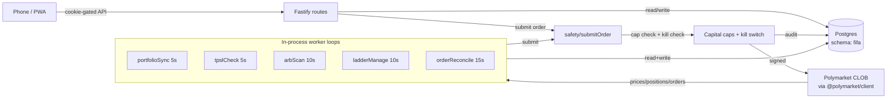

# FIFA Trader — Implementation Plan

## Summary

Execute the design in `SPEC.md` against the strategy in `ce/strategy.md`. The monorepo scaffold, shared types, server skeleton, DB schema, and Polymarket SDK install are already in place (see "Done so far" below). This plan breaks the **remaining** work into reviewable units, ordered by dependency, grouped by strategy track. Each unit is a thin slice intended to map to one `/subagent-driven-development` task and one `/ce-code-review` pass.

## Done so far

These items are complete and only relisted so the plan is the single source of truth. See [SPEC.md "Build progress"](../SPEC.md) for the canonical checklist.

- Root workspace (`package.json`, `tsconfig.base.json`, `.gitignore`, `.env.example`, `README.md`)
- `shared/` package with all DTOs (Market, Position, Order, StrategyKind, ArbOpportunity, etc.)
- `server/` package scaffold (`env.ts`, `logger.ts`, `drizzle.config.ts`)
- DB schema in `server/src/db/schema.ts` (all 9 tables under `fifa` schema)
- `@polymarket/client@beta` + `viem` installed; `bun.lock` committed
- Workflow guidance in `.claude/CLAUDE.md` and strategy doc in `ce/strategy.md`

---

## Key technical decisions

| Decision | Choice | Rationale |
|---|---|---|
| Runtime | Bun 1.3+ | Native TS for server + worker; single install command; lockfile already committed |
| Polymarket SDK | `@polymarket/client@0.1.0-beta.6` via `/viem` subpath | Old `@polymarket/clob-client` is archived; beta is the only viable SDK. Multiple entrypoints (`/node`, `/viem`, `/actions`); `/viem` is the right one for our viem signer |
| Wallet model | Server holds EOA private key in `PRIVATE_KEY` env | User accepted risk explicitly. L2 creds (api_key/secret/passphrase) derived once at boot and persisted in `clob_credentials` |
| Auth | Single `SESSION_SECRET`; HttpOnly cookie set at `/unlock` | Single-user app; full auth is non-goal |
| Workers | In-process `setInterval` loops sharing the DB pool and SDK client | Railway gives us a real long-running container; no need for a queue service for v1 |
| Order submission | Every order flows through `safety/submitOrder()` | Centralizes capital-cap, kill-switch, and audit-log enforcement so no path bypasses them |
| Region | Pin Railway functions to EU (matches Polymarket's eu-west-2 geoblock) | US edge would 451 on every CLOB call |
| Testing posture | Light. Unit tests for pure logic (arb math, cap enforcement). Manual smoke tests for routes and UI. No e2e suite | Personal app; over-testing slows the build. Trading math is the load-bearing test surface |
| Web build | Vite production build served by Fastify static plugin in prod | One Railway service, one URL; no separate CDN |

---

## High-level technical design



Directional only — not implementation specification.

---

## Output structure (target after plan completion)

```
fifa/
├── server/src/
│   ├── index.ts                      (U6)
│   ├── env.ts                        (done)
│   ├── logger.ts                     (done)
│   ├── db/
│   │   ├── client.ts                 (done)
│   │   ├── schema.ts                 (done)
│   │   └── push.ts                   (U5)
│   ├── polymarket/
│   │   ├── client.ts                 (U7)
│   │   └── markets.ts                (U10)
│   ├── auth/
│   │   └── session.ts                (U8)
│   ├── safety/
│   │   ├── submitOrder.ts            (U9)
│   │   ├── killSwitch.ts             (U9)
│   │   └── caps.ts                   (U9)
│   ├── routes/
│   │   ├── system.ts                 (U8, U21)
│   │   ├── markets.ts                (U10)
│   │   ├── watchlist.ts              (U11)
│   │   ├── portfolio.ts              (U12)
│   │   ├── orders.ts                 (U13)
│   │   ├── strategies.ts             (U14)
│   │   ├── rules.ts                  (U15)
│   │   └── arbs.ts                   (U20)
│   ├── workers/
│   │   ├── runner.ts                 (U16)
│   │   ├── portfolioSync.ts          (U17)
│   │   ├── orderReconcile.ts         (U18)
│   │   ├── tpslCheck.ts              (U22)
│   │   ├── arbScan.ts                (U19)
│   │   └── ladderManage.ts           (U25)
│   └── strategies/
│       ├── dutchArb.ts               (U19)
│       ├── yesnoArb.ts               (U19)
│       ├── tpsl.ts                   (U22)
│       ├── trailingStop.ts           (U23)
│       ├── scaleOut.ts               (U24)
│       └── limitLadder.ts            (U25)
├── web/
│   ├── src/
│   │   ├── main.tsx                  (U26)
│   │   ├── App.tsx                   (U26)
│   │   ├── routes.tsx                (U26)
│   │   ├── lib/
│   │   │   ├── api.ts                (U27)
│   │   │   └── queryClient.ts        (U27)
│   │   ├── components/ui/            (U26 — shadcn primitives)
│   │   ├── components/sparkline.tsx  (U30)
│   │   └── pages/
│   │       ├── unlock.tsx            (U28)
│   │       ├── home.tsx              (U29)
│   │       ├── markets.tsx           (U30)
│   │       ├── market-detail.tsx     (U30)
│   │       ├── portfolio.tsx         (U31)
│   │       ├── strategies.tsx        (U32)
│   │       ├── arbs.tsx              (U33)
│   │       └── settings.tsx          (U34)
│   ├── public/
│   │   ├── manifest.json             (U35)
│   │   └── icons/                    (U35)
│   ├── vite.config.ts                (U26, U35)
│   ├── tailwind.config.js            (U26)
│   └── index.html                    (U26)
├── drizzle/                          (auto-gen from U5)
├── railway.json                      (U36)
└── ...
```

---

## Implementation units

### Foundations (sequential — blockers for everything else)

#### U5. Drizzle push to Railway Postgres

- **Goal**: Provision the database. Run `drizzle-kit push` against the Railway Postgres URL, create the `fifa` schema, verify all 9 tables exist.
- **Dependencies**: None (DB schema authored).
- **Files**: `server/src/db/push.ts` (one-off script that imports schema and runs push), `drizzle/` (generated).
- **Approach**: Use `drizzle-kit push --force` against `DATABASE_URL` once the Railway Postgres add-on is provisioned. Add a `bun run db:push` script (already in `server/package.json`). Add a small bootstrap check in `server/src/index.ts` that runs a `SELECT 1` on startup and logs schema presence.
- **Verification**: `bun run db:push` succeeds; `psql $DATABASE_URL -c '\dt fifa.*'` lists 9 tables.
- **SPEC marker**: flip "Drizzle schema pushed to Railway Postgres" → `[x]`.

#### U6. Fastify app bootstrap

- **Goal**: Minimal Fastify server that boots, logs cleanly, registers `@fastify/cookie` and `@fastify/sensible`, exposes a `/healthz` endpoint, and connects to the DB. No business routes yet.
- **Dependencies**: U5.
- **Files**: `server/src/index.ts`.
- **Approach**: Construct Fastify with logger from `logger.ts`. Register cookie + sensible plugins. Register a `GET /healthz` that returns `{ ok: true, db: 'reachable' }` after running `SELECT 1` via the drizzle client. Read `env.PORT` and listen on `0.0.0.0` (Railway requires this).
- **Verification**: `bun run dev:server` boots without error; `curl localhost:3000/healthz` returns ok.
- **SPEC marker**: nothing flips (this is plumbing).

#### U7. Polymarket client wrapper

- **Goal**: Centralize Polymarket SDK init behind one module: public client (no creds), secure client (private-key signer), and a one-shot L2-creds bootstrap that persists to `clob_credentials`.
- **Dependencies**: U6.
- **Files**: `server/src/polymarket/client.ts` (exports `getPublicClient()` and `getSecureClient()`, both memoized; lazy creds bootstrap).
- **Approach**: Use `@polymarket/client/viem` for the viem-signer secure client. On first `getSecureClient()` call: check `clob_credentials` table; if empty, call SDK to derive L2 creds, insert into table; if present, instantiate secure client with stored creds. Also call `setupTradingApprovals()` once on first secure-client init (idempotent per SDK docs).
- **Test scenarios**:
  - Happy: with no `clob_credentials` row, first `getSecureClient()` derives creds and writes the row; second call reads from the row without re-deriving.
  - Edge: malformed `PRIVATE_KEY` env throws on env load (already covered by zod), not at SDK call.
  - Error: SDK derive failure surfaces with clear log line; row not written.
- **Verification**: After fresh boot with empty DB, log shows "polymarket: derived L2 creds and persisted"; on second boot, log shows "polymarket: loaded L2 creds from DB"; `getPublicClient().fetchMarket(...)` returns a known FIFA market.
- **SPEC marker**: flip "Polymarket CLOB client + L1→L2 bootstrap" → `[x]`.

#### U8. Session-secret unlock gate

- **Goal**: A `POST /unlock` route that compares submitted secret to `SESSION_SECRET` and sets an HttpOnly cookie. A Fastify hook gates every other route except `/unlock` and `/healthz`. A `GET /session` returns `{ unlocked: bool }`.
- **Dependencies**: U6.
- **Files**: `server/src/auth/session.ts` (plugin), `server/src/routes/system.ts` (`/unlock`, `/session`, `/healthz` is already in U6).
- **Approach**: Use `@fastify/cookie`. Cookie name `fifa_session`, value is the secret itself encoded (single-user app — adequate). HttpOnly + Secure (in prod) + SameSite=Lax. The preHandler hook checks the cookie value matches `env.SESSION_SECRET`; if not, 401.
- **Test scenarios**:
  - Happy: `POST /unlock` with correct secret sets cookie; subsequent GET to a protected route succeeds.
  - Error: wrong secret returns 401 and no cookie set.
  - Error: protected route without cookie returns 401.
- **Verification**: Manual curl sequence: unlock → call `/portfolio` (stubbed) → expect ok.
- **SPEC marker**: flip "Session-secret unlock gate" → `[x]`.

#### U9. Safety: submitOrder + killSwitch + caps

- **Goal**: One `submitOrder(input, opts)` function used by every code path that places orders. Enforces global kill switch, per-strategy capital cap, and writes to `order_log` before and after the SDK call.
- **Dependencies**: U7.
- **Files**: `server/src/safety/submitOrder.ts`, `server/src/safety/killSwitch.ts`, `server/src/safety/caps.ts`.
- **Approach**: `killSwitch.ts` reads a `kill_switch` row from a tiny new table (or sets `enabled=false` on every strategy_config — pick the simpler one; see open question Q1). `caps.ts` exports `assertWithinCap(strategyId, costUsdc)` that sums recent `strategy_executions.size * price` and rejects if it would breach `strategy_configs.capital_cap`. `submitOrder.ts`: pre-check (kill switch + cap) → write `order_log` as `submitted` → call SDK `placeLimitOrder`/`placeMarketOrder` → update `order_log` with response/error.
- **Test scenarios**:
  - Happy: order under cap, kill switch off → SDK called once, `order_log` has request + response.
  - Edge: order exactly at cap → still allowed; one over → rejected with `OrderRejected: cap_breach`.
  - Error: kill switch on → `OrderRejected: kill_switch`; SDK not called; `order_log` records the rejection.
  - Error: SDK throws → `order_log` updated with `error_message`; the throw propagates.
- **Verification**: Unit tests for `caps.ts` cap math; manual exercise of kill switch via a dummy route.
- **SPEC marker**: nothing flips yet (UI for kill switch comes later); add row to `kill_switch_state` table if we go that route — schema change tracked in U9.

---

### Backend routes (sequential within group, but the group runs after Foundations)

#### U10. `/markets` routes

- **Goal**: `GET /markets` paginated FIFA market list; `GET /markets/:id` with orderbook snapshot.
- **Dependencies**: U7, U8.
- **Files**: `server/src/routes/markets.ts`, `server/src/polymarket/markets.ts` (helpers).
- **Approach**: List by calling `client.listMarkets({ closed: false })` and filtering to FIFA (category match + tag/slug heuristic). Detail by `fetchMarket(id)` + `fetchOrderBook(tokenId)` for each outcome.
- **Verification**: `curl /markets?stage=group` returns ≥1 market with `outcomes[].price` populated.
- **SPEC marker**: flip "`/markets` + `/markets/:id`" → `[x]`.

#### U11. `/watchlist` routes

- **Goal**: `GET /watchlist`, `POST /watchlist/:marketId`, `DELETE /watchlist/:marketId`.
- **Dependencies**: U6.
- **Files**: `server/src/routes/watchlist.ts`.
- **Approach**: Simple CRUD over `fifa.watchlist`. POST snapshots question/slug from current market so the list survives if Polymarket renames things.
- **Verification**: Add → list shows it; delete → list empty.
- **SPEC marker**: flip "`/watchlist`" → `[x]`.

#### U12. `/portfolio` route

- **Goal**: `GET /portfolio` returns positions + balances + computed PnL, all served from `positions_cache` + `balances_cache` (refreshed by U17, not by this route).
- **Dependencies**: U6.
- **Files**: `server/src/routes/portfolio.ts`.
- **Approach**: Join `positions_cache` with `watchlist` for question fallback; compute `currentValue`, `unrealizedPnl` from cached fields; include `Balances` rollup.
- **Verification**: After U17 has run once, `/portfolio` returns positions with non-zero current_price.
- **SPEC marker**: flip "`/portfolio`" → `[x]`.

#### U13. `/orders` routes

- **Goal**: `POST /orders` (submit), `DELETE /orders/:orderId` (cancel). Both flow through `safety/submitOrder()` (placement) and a parallel `cancelOrder()` helper.
- **Dependencies**: U9.
- **Files**: `server/src/routes/orders.ts`.
- **Approach**: Validate body with zod (matches `SubmitOrderInput` from `shared/`); pass through to `safety/submitOrder`. Cancel calls SDK `cancelOrder({ orderID })`.
- **Verification**: Place a test buy at very low price (won't fill); cancel it.
- **SPEC marker**: flip "`/orders`" → `[x]`.

#### U14. `/strategies` routes (list/toggle/allocate)

- **Goal**: `GET /strategies` (with realizedPnl rollup), `POST /strategies/:id/toggle`, `POST /strategies/:id/allocate`.
- **Dependencies**: U6.
- **Files**: `server/src/routes/strategies.ts`.
- **Approach**: On first GET if `strategy_configs` is empty, seed one row per `STRATEGY_KINDS`. Toggle flips `enabled`. Allocate sets `capital_cap`. PnL rollup sums `strategy_executions.pnl`.
- **Verification**: Seed runs once; toggling persists; allocate validates non-negative.
- **SPEC marker**: flip "`/strategies` (list, toggle, allocate)" → `[x]`.

#### U15. `/strategies/:id/rules` CRUD

- **Goal**: GET/POST/DELETE for per-position rules attached to a strategy.
- **Dependencies**: U14.
- **Files**: `server/src/routes/rules.ts`.
- **Approach**: Zod schemas branch on `strategy.kind` to validate the `rule` shape (`TpSlRule` | `TrailingStopRule` | `ScaleOutRule` | `LimitLadderRule`). Status enum: `active | paused | consumed | cancelled`.
- **Verification**: Create a TP/SL rule on a position; list shows it; delete works.
- **SPEC marker**: flip "`/strategies/:id/rules`" → `[x]`.

---

### Edge engine — Track 1 (priority)

The headline track. **Build in this order; U19 unblocks the worker scan and U20 unblocks UI.**

#### U16. Worker runner

- **Goal**: A single `startWorkers()` invoked by `index.ts` that registers each loop with its interval and shared error handling, plus a `stopWorkers()` for graceful shutdown.
- **Dependencies**: U7.
- **Files**: `server/src/workers/runner.ts`.
- **Approach**: Each worker is `{ name, intervalMs, run: () => Promise<void> }`. Runner wraps each `run` in try/catch with structured log + jittered backoff on error. Exposes `getHealth()` for the `/healthz` route to show per-loop last-run time.
- **Verification**: Boot logs "worker started: portfolioSync (5s)" etc.; one bad worker doesn't crash the others.
- **SPEC marker**: nothing flips (the individual workers do).

#### U17. portfolioSync worker

- **Goal**: Every 5s, fetch `listPositions()` + USDC balance from Polymarket, upsert into `positions_cache` + `balances_cache`, append a `price_history` row per held token.
- **Dependencies**: U16.
- **Files**: `server/src/workers/portfolioSync.ts`.
- **Approach**: SDK call → diff against `positions_cache` → upsert. Compute current_price from `fetchMidpoint` for each token (cheaper than full orderbook).
- **Verification**: After 10s, `positions_cache` matches account; `price_history` accumulates rows.
- **SPEC marker**: flip "`portfolioSync` (5s)" → `[x]`.

#### U18. orderReconcile worker

- **Goal**: Every 15s, walk `order_log` rows in non-terminal status, fetch order state from SDK, update `status` and downstream `strategy_executions.pnl` once filled.
- **Dependencies**: U16, U13.
- **Files**: `server/src/workers/orderReconcile.ts`.
- **Approach**: SDK `getOrders({ status: ['LIVE', 'OPEN'] })` or per-order `getOrder(id)`. On fill, write `strategy_executions` if `strategyId` was on the order_log row.
- **Verification**: Cancel an order via API → reconciler flips status within 15s.
- **SPEC marker**: flip "`orderReconcile` (15s)" → `[x]`.

#### U19. Dutch arb + YES/NO arb engines + arbScan worker

- **Goal**: Continuously scan watched markets for `sum(best_ask) < 1.00 - margin`; surface to `arb_opportunities`; expose a `computeStakes()` that returns equal-profit share counts.
- **Dependencies**: U16, U11.
- **Files**: `server/src/strategies/dutchArb.ts`, `server/src/strategies/yesnoArb.ts`, `server/src/workers/arbScan.ts`.
- **Approach**:
  - `arbScan` queries watchlist + top-N FIFA markets, calls `fetchOrderBooks([...tokenIds])`, computes sum-of-best-asks per market.
  - `dutchArb.ts` exports `detect(market, orderbooks)` returning `null` or an `ArbOpportunity`, and `computeStakes(prices, budget)` that solves the equal-profit allocation: `shares_i = K / price_i` where `K = budget / sum(1/price_i)` × normalization.
  - `yesnoArb.ts` is a thin wrapper over `dutchArb.ts` (binary case, 2 outcomes).
  - When detected, insert into `arb_opportunities`; if `strategy_configs[dutch_arb].autoExecute && capital_cap` allows, immediately call `safety/submitOrder` for each leg with `strategyId`.
- **Test scenarios**:
  - Math: prices `[0.3, 0.3, 0.3]` (sum=0.9) → stakes sum to budget; profit identical across all three outcomes within 1¢.
  - Math: prices `[0.5, 0.5]` (sum=1.0, no edge) → returns null.
  - Math: prices `[0.4, 0.45, 0.14]` (sum=0.99) → stakes produce ≥0 profit on each outcome.
  - Edge: thin orderbook (best_ask size < requested) → opportunity flagged but `executable=false`.
  - Cap: auto-execute disabled or cap exhausted → row inserted, no order placed.
- **Verification**: Synthetic test against canned orderbook fixtures; live: insert a manual `watchlist` row for any 3-outcome FIFA market and watch logs for "arb opp detected: sum=...".
- **SPEC marker**: flip "Dutch arbitrage scanner + executor (priority)", "YES/NO arbitrage scanner + executor", and "`arbScan` (10s)" → `[x]`.

#### U20. `/arb` routes

- **Goal**: `GET /arb/opportunities` (recent + active), `POST /arb/execute/:oppId` (manual fire).
- **Dependencies**: U19.
- **Files**: `server/src/routes/arbs.ts`.
- **Approach**: List from `arb_opportunities` (newest 50). Execute loads the opp, validates still-profitable using fresh orderbook (refuse if drifted), fires legs via `safety/submitOrder`.
- **Verification**: GET shows the opps U19 inserted; manual execute fires real orders.
- **SPEC marker**: flip "`/arb/opportunities` + `/arb/execute`" → `[x]`.

#### U21. `/kill-switch` route

- **Goal**: `POST /kill-switch` cancels all open orders via SDK, sets the kill flag, disables every strategy. `GET /kill-switch` shows current state.
- **Dependencies**: U9.
- **Files**: `server/src/routes/system.ts` (extend), `server/src/safety/killSwitch.ts` (extend).
- **Approach**: SDK `cancelOrders()` for all live order ids drawn from `order_log`; set flag; set `enabled=false` on every `strategy_configs`.
- **Verification**: With an open order, hit kill-switch → order cancelled within seconds; all strategies show disabled.
- **SPEC marker**: flip "`/kill-switch`" → `[x]`.

---

### Position management — Track 2

#### U22. tpslCheck worker + TP/SL engine

- **Goal**: Every 5s, walk active `strategy_rules` for `tp_sl` strategy; if mark crosses TP or SL, fire a sell via `safety/submitOrder`; mark rule as `consumed`.
- **Dependencies**: U16, U15.
- **Files**: `server/src/workers/tpslCheck.ts`, `server/src/strategies/tpsl.ts`.
- **Approach**: `tpslCheck` loops; per active rule, fetch current mark from `positions_cache.current_price` (already 5s-fresh from U17); `tpsl.ts` exports `shouldFire(rule, mark)` and `buildSellOrder(rule, position)`.
- **Test scenarios**:
  - TP only: mark < TP → no fire; mark ≥ TP → fire; rule marked consumed.
  - SL only: mark > SL → no fire; mark ≤ SL → fire.
  - Both: mark crosses TP first → fires TP; SL ignored.
  - Stale price (`positions_cache.updated_at` > 60s old) → skip, log warning.
- **Verification**: Insert a TP rule at current price ± a tiny ε; loop fires within 5s; rule status flips to `consumed`.
- **SPEC marker**: flip "Take-profit / Stop-loss" and "`tpslCheck` (5s)" → `[x]`.

#### U23. Trailing stop engine (shares tpslCheck loop)

- **Goal**: Add `trailing_stop` rule kind to the same poller. Each tick: if mark > rule's `highWaterMark`, ratchet up by `trailPct`; if mark ≤ current `triggerPrice`, fire sell.
- **Dependencies**: U22.
- **Files**: `server/src/strategies/trailingStop.ts`, extend `tpslCheck.ts` to dispatch by `kind`.
- **Approach**: `trailingStop.ts.tick(rule, mark)` returns `{ updatedRule, fire }`. Worker upserts the updated rule (high water mark + trigger price) when no fire; submits sell when fire.
- **Test scenarios**:
  - Mark rises: high water + trigger both ratchet up.
  - Mark falls below trigger: fires.
  - Mark falls but stays above trigger: no fire, high water unchanged.
- **Verification**: Synthetic price feed in a unit test; live: hand-create a rule with `trailPct=0.05`, watch the rule row's `rule.triggerPrice` move with the mark.
- **SPEC marker**: flip "Trailing stop" → `[x]`.

#### U24. Scale-out / partial TP engine

- **Goal**: Add `scale_out` rule kind. Each leg fires independently when mark ≥ `legs[i].atPrice`; leg is then marked `consumed=true` so it doesn't refire.
- **Dependencies**: U22.
- **Files**: `server/src/strategies/scaleOut.ts`, extend `tpslCheck.ts`.
- **Approach**: `scaleOut.ts.checkLegs(rule, mark, positionShares) → { firingLegs, updatedRule }`. Worker fires a sell per firing leg with `size = position.shares * (leg.pct / 100)`; updates rule with consumed flags.
- **Test scenarios**:
  - Legs `[{pct:25, at:0.4}, {pct:25, at:0.6}, {pct:50, at:0.8}]`; mark hits 0.5 → leg 0 fires only.
  - Subsequent tick at 0.65 → leg 1 fires; leg 0 stays consumed.
  - Mark drops back to 0.3 → nothing fires.
- **Verification**: Unit test the leg consumption logic.
- **SPEC marker**: flip "Scale-out / partial TP" → `[x]`.

#### U25. Limit-order ladders engine + ladderManage worker

- **Goal**: Place a grid of resting orders; worker keeps rungs in sync (place missing, optional refill on fill, cap on max active).
- **Dependencies**: U16, U18, U15.
- **Files**: `server/src/strategies/limitLadder.ts`, `server/src/workers/ladderManage.ts`.
- **Approach**: Rule stores `rungs: LimitLadderRung[]` with `orderId` and `filled` per rung. Worker every 10s: for each active rung without an `orderId`, place; if `filled=true` and `topUp=true`, place a new rung. Honor `maxActive` cap.
- **Test scenarios**:
  - Fresh ladder with 5 rungs → all 5 placed within one tick.
  - One rung fills (detected by `orderReconcile`) → if topUp, new order at same level; if not, ladder size shrinks.
  - `maxActive=3` with 5 rungs configured → only 3 active at any time.
  - Strategy disabled mid-flight → no new orders placed; existing orders left alone (use `/kill-switch` or per-rule delete to actually cancel).
- **Verification**: Manual config of a 3-rung ladder; watch orders appear in Polymarket UI.
- **SPEC marker**: flip "Limit-order ladders" and "`ladderManage` (10s)" → `[x]`.

---

### Mobile fluency — Track 3

All web units can run in parallel with each other after **U26** lands the scaffold. They're sequential with the backend routes they consume.

#### U26. Vite + React + Tailwind + shadcn scaffold

- **Goal**: `bun run dev:web` boots Vite at 5173 with a blank routed shell; Tailwind compiled; one shadcn button proves the component pipeline.
- **Dependencies**: None.
- **Files**: `web/vite.config.ts`, `web/index.html`, `web/src/main.tsx`, `web/src/App.tsx`, `web/src/routes.tsx`, `web/src/index.css`, `web/tailwind.config.js`, `web/postcss.config.js`, `web/tsconfig.json`, `web/src/components/ui/button.tsx` (shadcn primitive).
- **Approach**: React Router with empty route stubs for `/unlock`, `/`, `/markets`, `/markets/:id`, `/portfolio`, `/strategies`, `/arbs`, `/settings`. Tailwind base + shadcn theme tokens. Mobile-first layout with safe-area insets.
- **Verification**: `bun run dev:web` renders a Hello World with a shadcn `<Button>`.
- **SPEC marker**: flip "Vite + React + Tailwind + shadcn scaffold" → `[x]`.

#### U27. API client + TanStack Query setup

- **Goal**: Typed `fetch` client with cookie credentials, plus `QueryClientProvider` configured. Every page consumes API via `useQuery`/`useMutation` hooks.
- **Dependencies**: U26.
- **Files**: `web/src/lib/api.ts`, `web/src/lib/queryClient.ts`, dev-only proxy in `vite.config.ts` forwarding `/api/*` to `localhost:3000`.
- **Approach**: `api.get/post/delete` accept generic types from `@fifa/shared`. Throws `ApiError` on non-2xx; 401 redirects to `/unlock`.
- **Verification**: From a test page, `useQuery({ queryKey: ['session'], queryFn: () => api.get<{unlocked: boolean}>('/api/session') })` resolves.
- **SPEC marker**: nothing flips (plumbing).

#### U28. Unlock page

- **Goal**: `/unlock` page with a single password input and submit button. On success, navigate to `/`.
- **Dependencies**: U27.
- **Files**: `web/src/pages/unlock.tsx`.
- **Approach**: shadcn `Input` + `Button`. POST to `/api/unlock`. Show error inline on 401.
- **Verification**: Wrong secret shows error; right secret lands on home.
- **SPEC marker**: nothing specific (part of "Unlock gate" already flipped in U8).

#### U29. Home / Watchlist page

- **Goal**: Home shows the watchlist as a vertical list of cards. Each card: question, current YES price (big), 24h change badge, mini Recharts sparkline.
- **Dependencies**: U27, U30 (sparkline component).
- **Files**: `web/src/pages/home.tsx`, `web/src/hooks/useWatchlist.ts`.
- **Approach**: Polls `/api/watchlist` every 5s via TanStack Query. Tap card → market detail.
- **Verification**: Add a watchlist row via API; appears on home; prices update.
- **SPEC marker**: flip "Home / Watchlist" → `[x]`.

#### U30. Markets list + market detail + Recharts sparkline

- **Goal**: `/markets` searchable list of FIFA markets; `/markets/:id` shows orderbook table, full-size Recharts line chart of recent price history, "Buy YES" / "Buy NO" sheet, and add-to-watchlist toggle.
- **Dependencies**: U27.
- **Files**: `web/src/pages/markets.tsx`, `web/src/pages/market-detail.tsx`, `web/src/components/sparkline.tsx`.
- **Approach**: Sparkline = `<LineChart>` with no axes, small height, fed from `/api/markets/:id?history=1h`. Buy sheet uses shadcn `Sheet` with size + limit price inputs; submit hits `/api/orders`.
- **Verification**: Open detail page for a known market; chart renders; submitting a tiny buy succeeds.
- **SPEC marker**: flip "Markets list + Market detail" and "Recharts sparklines on watchlist + detail" → `[x]`.

#### U31. Portfolio + one-tap sell sheet

- **Goal**: List of positions with cost, mark, unrealized PnL; each card has a "Sell" button that opens a sheet with `25% / 50% / 100% • market / limit X` controls. Single tap on a preset → order submitted.
- **Dependencies**: U27.
- **Files**: `web/src/pages/portfolio.tsx`, `web/src/components/sell-sheet.tsx`.
- **Approach**: Sheet defaults to "100% market". User can tap a different chip and submit in one more tap. Otherwise pure read-only data binding to `/api/portfolio`.
- **Verification**: With an open position, the sell sheet submits and the position updates.
- **SPEC marker**: flip "Portfolio + one-tap sell sheet" → `[x]`.

#### U32. Strategies control panel

- **Goal**: One card per strategy with enable toggle, capital allocation slider/input, auto-execute toggle (where applicable), per-strategy PnL, and a "kill this strategy" mini-button.
- **Dependencies**: U27.
- **Files**: `web/src/pages/strategies.tsx`.
- **Approach**: Render `STRATEGY_KINDS` in `STRATEGY_LABELS` order. Each card collapses to show rules below (link to a rules drawer).
- **Verification**: Toggling persists; reload → still toggled.
- **SPEC marker**: flip "Strategies control panel" → `[x]`.

#### U33. Arbs page

- **Goal**: List of recent Dutch + YES/NO arb opportunities with expected profit, required capital, per-outcome stakes, and an "Execute" button. Live-refreshes every 5s.
- **Dependencies**: U27.
- **Files**: `web/src/pages/arbs.tsx`.
- **Approach**: GET `/api/arb/opportunities`; row shows freshness ("8s ago"). Execute confirms in a sheet before firing.
- **Verification**: A flagged opp shows up live; execute hits the route.
- **SPEC marker**: flip "Arbs page" → `[x]`.

#### U34. Settings page

- **Goal**: Show env health (DB OK, Polymarket creds OK, worker last-tick times), big red "KILL SWITCH" button, "log out" (clear session cookie), and a "rebootstrap creds" button.
- **Dependencies**: U27.
- **Files**: `web/src/pages/settings.tsx`.
- **Approach**: Pulls `/healthz` (extended in U16 with worker stats). Kill switch double-confirms before POSTing.
- **Verification**: Health row goes red if DB is down (simulate by killing the connection).
- **SPEC marker**: flip "Settings (kill switch, env health)" → `[x]`.

#### U35. PWA manifest + service worker

- **Goal**: `manifest.json` with icons + theme color; `vite-plugin-pwa` configured for offline-tolerant caching of static assets only (not API calls). Installable on iPhone home screen.
- **Dependencies**: U26.
- **Files**: `web/public/manifest.json`, `web/public/icons/*.png`, `web/vite.config.ts` (extend with VitePWA).
- **Approach**: `registerType: 'autoUpdate'`, `workbox.runtimeCaching: []` (we don't want stale API data). Theme color matches brand.
- **Verification**: On a phone, open the deployed URL → Safari shows "Add to Home Screen" with the app icon.
- **SPEC marker**: flip "PWA manifest + service worker" → `[x]`.

---

### Deploy — Track 5

#### U36. Railway config + serve built web from Fastify

- **Goal**: Railway deploys the monorepo as one service with Postgres add-on, EU region, env vars set, web served via `@fastify/static` from `web/dist`.
- **Dependencies**: All other tracks landed (or at least U26 + U6).
- **Files**: `railway.json` (build + start commands), `server/src/index.ts` (register `@fastify/static` for `web/dist` in prod), root `package.json` `start` script: `bun run build && NODE_ENV=production bun ./server/src/index.ts`.
- **Approach**: Railway detects Bun via `engines.bun`. Build step: `bun install --frozen-lockfile && bun run build`. Region: `eu-west2` or closest non-georestricted EU.
- **Verification**: `railway up` succeeds; public URL serves the PWA; one-tap sell works against real Polymarket.
- **SPEC marker**: flip "Railway service + Postgres add-on", "env vars set + region pinned EU", "PWA installable on phone" → `[x]`.

---

## Parallelism map

After U5–U9 (foundations) land, the rest is heavily parallel:

```
                          U5 → U6 → U7 → U8 → U9
                                            │
        ┌───────────────────────────────────┼───────────────────────────────┐
        │ Backend routes (sequential within)│ Edge engine (priority)        │
        │ U10 ─ U11 ─ U12 ─ U13 ─ U14 ─ U15 │ U16 ─ U17 ─ U18 ─ U19 ─ U20   │
        │                                   │                            U21│
        ├───────────────────────────────────┼───────────────────────────────┤
        │ Position management (after U16)   │ Mobile fluency (after U26)    │
        │ U22 ─┬─ U23                       │ U26 ─ U27 ─┬─ U28 ─ U29 ─ U30 │
        │      ├─ U24                       │            ├─ U31 ─ U32 ─ U33 │
        │      └─ U25                       │            ├─ U34 ─ U35       │
        └───────────────────────────────────┴───────────────────────────────┘
                                            │
                                       Deploy: U36
```

Suggested subagent fan-out:
- **Slot A (backend chain)**: U10 → U11 → U12 → U13 → U14 → U15
- **Slot B (edge engine)**: U16 → U17 → U18 → U19 → U20 → U21
- **Slot C (position mgmt)**: blocked until U16; then U22 → (U23 + U24 + U25 parallel)
- **Slot D (web)**: U26 → U27 → (U28..U35 parallel)
- **Final**: U36

---

## Scope boundaries

### In scope (v1)

Everything in `SPEC.md` § Features 1–9, plus all 6 strategies built fully (no stubs).

### Deferred to follow-up work

- Auto-execute for limit ladders beyond simple top-up (e.g. price-band re-pricing).
- Trade history filtering / search beyond the basic list.
- Strategy-level realized PnL split by realized vs unrealized — v1 reports a single rollup.

### Outside this product's identity

- Multi-user / auth (single-user app).
- Mobile push notifications (in-app polling is enough during matches).
- News / event-driven strategies (no goal feed wired).
- Mean-reversion / vol-based strategies (deferred per strategy doc).
- Full TradingView-style charting.

---

## Risks & dependencies

| Risk | Likelihood | Impact | Mitigation |
|---|---|---|---|
| `@polymarket/client@beta` has incomplete method coverage | Medium | High | If a method is missing, fall back to direct HTTP against the documented CLOB endpoints (paths catalogued in [`llms.txt`](https://docs.polymarket.com/llms.txt)). All access is funneled through `polymarket/client.ts` so the swap is local |
| Geoblock at Polymarket eu-west2 still applies to Railway EU egress | Low | High | Verify with a healthz-style call early in U36; if blocked, switch to a different EU region or self-host via a tunnel |
| Server private key compromise = full account drain | Acceptable | High | User explicitly accepts. Mitigations: per-strategy caps cap the bleed; kill switch cancels all open orders; session secret gates the routes that would set new rules |
| Worker loop wedges and stops trading | Medium | Medium | Per-loop try/catch + jittered backoff in U16; `/healthz` shows last-tick per loop; settings page surfaces stale workers visibly |
| Capital cap arithmetic drifts (rounding, race) | Medium | High | Unit tests on `caps.ts`; serialize order placement per strategy with a tiny per-strategy in-process mutex |
| Polymarket SDK requires Node ≥24; Bun 1.3 maps OK but some imports may break | Low | Medium | Already installed and importable; revisit at U7 if anything blows up |

---

## Open questions

| ID | Question | Owner | Status |
|---|---|---|---|
| Q1 | Kill switch as a dedicated table row vs. "every strategy.enabled=false"? | implementer | Decide in U9; lean toward dedicated row (single read, cleaner audit) |
| Q2 | Should `/portfolio` proactively trigger a sync if `positions_cache.updated_at` is stale, or strictly serve cache? | implementer | Decide in U12; lean toward strictly cache + show "stale" badge in UI |
| Q3 | For Dutch arb auto-execute: cap by per-opportunity `MAX_AUTO_STAKE` or per-day rolling? | implementer | Decide in U19; lean toward per-opportunity for v1 |

---

## Verification rollup

When all 32 units land, the acceptance shape is:

1. Open Railway URL on phone, unlock with session secret, install PWA to home screen.
2. Open watchlist → see live prices ticking, sparklines populated.
3. Tap a market → orderbook + chart + sheet buys a tiny YES position; sell from portfolio in one tap.
4. Enable Dutch arb strategy with $X cap and auto-execute on → leave the phone; arb_opportunities table fills; auto-executes within cap.
5. Set a TP at a slightly-out-of-money price; price crosses; execution fires; strategy_executions row appears with realized PnL.
6. Hit kill switch → every open order cancels within seconds; every strategy goes disabled.
